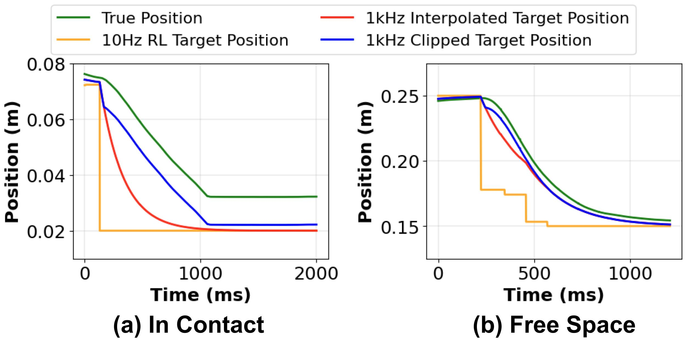

# SERL Franka Controllers

> SERL 中使用的 Franka 机器人控制器。SERL 全称为 A Software Suite for Sample-Efficient Robotic Reinforcement Learning。

SERL 项目主页和论文：

```text
https://serl-robot.github.io/
```

## 重要说明

这个目录是 SERL 原始的 `serl_franka_controllers` 包，面向 ROS1 / catkin / `franka_ros` / `ros_control`。

它不是当前 ROS2 / `franka_ros2` / `ros2_control` 中可直接加载的 `serl_cartesian_impedance_controller` 插件。

当前 SpaceMouse teleop 测试中需要的 controller 是 ROS2 controller，需要能够被下面命令看到：

```bash
ros2 control list_controller_types | grep -i serl
```

如果这里只看到 ROS1 的 `serl_franka_controllers-main`，而 ROS2 controller type 列表中没有 SERL controller，那么 `controller_manager` 无法加载 `serl_cartesian_impedance_controller`。

## 功能概述

`serl_franka_controllers` 是一个通过 `libfranka` 和 `franka_ros` 控制 Franka Emika 机器人的 ROS 包。它提供两个主要控制器：

- Cartesian Impedance Controller：用于安全在线强化学习的笛卡尔阻抗控制器；
- Joint Position Controller：用于机械臂 reset 或移动到指定关节位置的关节位置控制器。

该阻抗控制器的设计目标是在保持柔顺性的同时获得较高位置精度。实现方式是在实时控制循环中限制阻抗控制器参考点与当前位姿之间的距离。这样可以使用较高控制增益来提高精度，同时在接触物体时避免过大的力。



## 安装

### 前置依赖

- ROS Noetic
- 按照 Franka FCI 文档安装 `libfranka>=0.8.0` 和 `franka_ros>=0.8.0`

```bash
sudo apt install ros-noetic-libfranka ros-noetic-franka-ros
```

### 通过 apt-get 安装

```bash
sudo apt-get install ros-serl_franka_controllers
```

### 从源码安装

```bash
cd ~/catkin_ws/src
git clone git@github.com:rail-berkeley/serl_franka_controllers.git
cd ~/catkin_ws
catkin_make --pkg serl_franka_controllers
source ~/catkin_ws/devel/setup.bash
```

### 实时内核限制

`franka_ros` 默认要求实时内核。如果同一台机器还需要安装 CUDA，实时内核配置可能不方便。一个折中方案是在下面的配置文件中忽略实时约束：

```text
catkin_ws/src/franka_ros/franka_control/config/franka_control_node.yaml
```

将配置改为：

```yaml
realtime_config: ignore
```

## 使用方法

### Cartesian Impedance Controller

启动笛卡尔阻抗控制器：

```bash
roslaunch serl_franka_controllers impedance.launch robot_ip:=<RobotIP> load_gripper:=<true/false>
```

其中：

- `<RobotIP>` 替换为 Franka 机器人的实际 IP 地址；
- `load_gripper` 根据是否安装 Franka gripper 设置为 `true` 或 `false`。

控制器的柔顺参数可以通过交互式 GUI 调整：

```bash
rosrun rqt_reconfigure rqt_reconfigure
```

也可以在 Python 程序中通过 `dynamic_reconfigure` 调整，示例见下方 Python 示例。

### Joint Position Controller

如果需要 reset 机械臂，或让机器人移动到指定关节位置，可以使用关节位置控制器：

```bash
rosparam set /target_joint_positions '[q1, q2, q3, q4, q5, q6, q7]'
roslaunch serl_franka_controllers joint.launch robot_ip:=<RobotIP> load_gripper:=<true/false>
```

其中：

- `<RobotIP>` 替换为 Franka 机器人的实际 IP 地址；
- `load_gripper` 根据是否安装 gripper 设置；
- `[q1, q2, q3, q4, q5, q6, q7]` 替换为目标关节角。

## rospy 示例

本包包含一个 `requirements.txt` 和一个 Python 示例脚本，用来展示如何与 controller 交互。

该示例演示了：

- 如何调整 reference limiting 参数；
- 如何通过 ROS topic 发送机器人命令；
- 如何通过 `dynamic_reconfigure` 修改控制器参数。

运行方式：

```bash
conda create -n serl_controller python=3.8
conda activate serl_controller
pip install -r requirements.txt
python test/test.py --robot_ip=ROBOT_IP
```

将 `ROBOT_IP` 替换为 Franka 机器人的实际 IP 地址。

## 与当前 ROS2 teleop 测试的关系

当前 `Code/spacemouse_franka_teleop_test` 使用的是 ROS2 / `controller_manager` / `ros2_control` 路线，目标 controller 名称为：

```text
serl_cartesian_impedance_controller
```

目标位姿 topic 为：

```text
/serl_cartesian_impedance_controller/target_pose
```

因此，若要让当前 teleop_test 真正控制机器人，需要一个 ROS2 版 controller 插件，而不是直接使用本目录的 ROS1 controller。

健康状态应满足：

```bash
ros2 control list_controllers
```

能看到：

```text
joint_state_broadcaster active
franka_robot_state_broadcaster active
serl_cartesian_impedance_controller active
```

并且：

```bash
ros2 topic info /serl_cartesian_impedance_controller/target_pose -v
```

应显示至少一个 controller subscriber。
